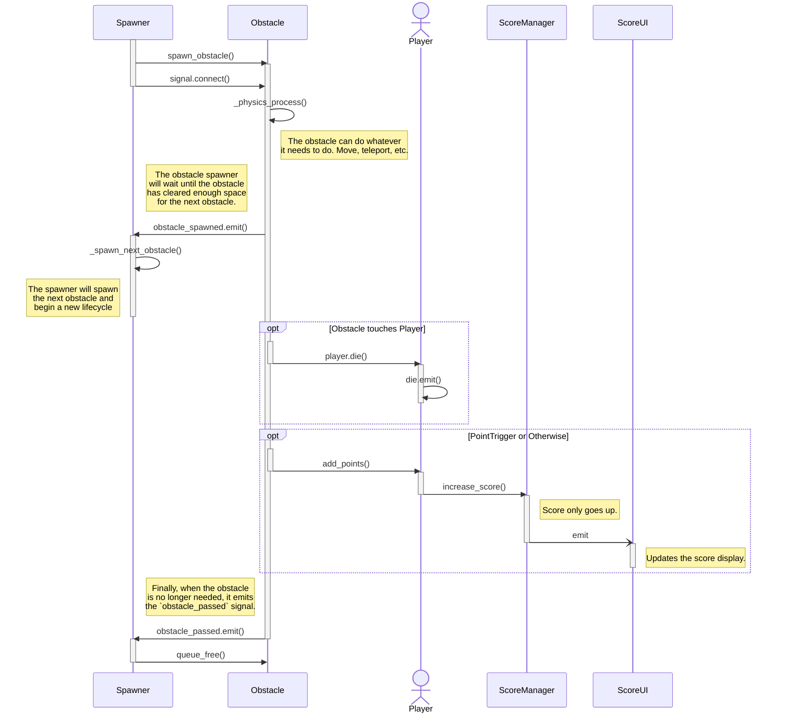

# Space Tap: The Game

An Open-Source game template for the [Godot Engine](https://godotengine.org/). This game template is heavily inspired by [Flappy Bird](https://en.wikipedia.org/wiki/Flappy_Bird).

> Pending screenshot after polishing the game template.

## Playable Demo

You can play the latest version of the game template on [Itch.io](https://rgonzaleztech.itch.io/spacetap). The demo is updated with every published release.

## Features

### Player

The player is a simple `Rigidbody2D` node that ties together some manager classes.

| Node Class | Description |
| --- | --- |
| `InputManager` | Reads input and reports the player's intent |
| `ScoreManager` | Keeps track of the player's score, can only count up |
| `ScoreUI` | Displays the player's score |

The player can emit the `died` signal, which is triggered by the `die()` function. This signal is called by other nodes when they touch the player or otherwise cause the player to lose the game.

| Function | Description |
| --- | --- |
| `die(obstacle)` | Emits the `died` signal |
| `add_points(points)` | Adds points to the player's `ScoreManager`. If it has a `ScoreUI`, it will update the `ScoreUI`. |

> Pending "More Details" wiki link

### Obstacles

This template implements obstacles in an abstract class (`BaseObstacle`) to encourage the implementation of different obstacle types (such as `MovingObstacle`). Also, the `PointTrigger` Area2D node is used to give points to the player when they pass through it. 

This means that you can create different obstacle scenes that contain 0 or more point areas and can kill the player in different ways (so long as they call the `die()` function).

#### Obstacle Signals

| Signal | Description |
| --- | --- |
| `obstacle_passed` | Emitted when the obstacle can be removed from the scene. |
| `obstacle_spawned` | Emitted when the obstacle has fully spawned (Cleared enough space for the next obstacle). |

#### Obstacle Lifecycle

> Pending obstacle spawning management system

> Pending game state management system.

## Development

### Prerequisites

- [Godot Engine 4.1](https://godotengine.org/download)
- [Git LFS](https://git-lfs.github.com/)

## Contributing

Please read [CONTRIBUTING.md](CONTRIBUTING.md) for details. In short, check out the [issues](https://github.com/RGonzalezTech/SpaceTap/issues) and see if there's anything you can help with. If you have an idea for a new feature, please open an issue to discuss it first.

For high-level planning, please see the [Projects](https://github.com/RGonzalezTech/SpaceTap/projects?query=is%3Aopen) tab. That will give you an idea of what's being worked on and what's coming up.